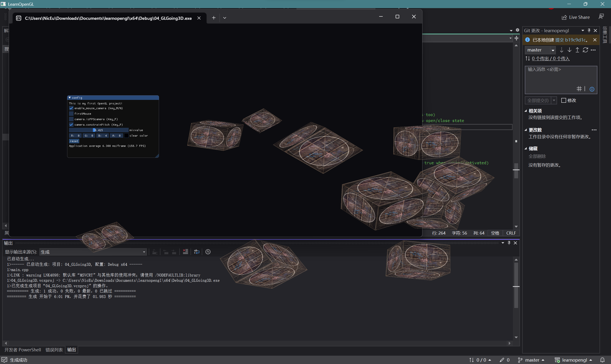

# Nicolas-L0/learnopengl

This repo is a personal outcome of following the learning process of [LearnOpenGL](learnopengl.com)

## Outcome 1

Start from [01_GLTriangle](https://github.com/Nicolas-L0/learnopengl/tree/master/01_GLTriangle) to [04_GLGoing3D](https://github.com/Nicolas-L0/learnopengl/tree/master/04_GLGoing3D)

---
Special Thanks to the [LearnOpenGL](learnopengl.com), [learnopengl-cn](learnopengl-cn.github.io) and their dedicated teams of contributors.