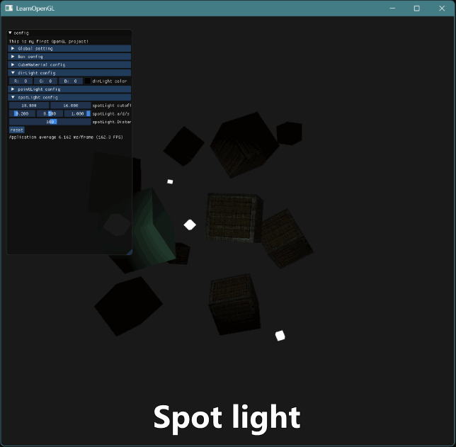

# Nicolas-L0/learnopengl

This repo is a personal outcome of following the learning process of [LearnOpenGL](learnopengl.com)

---

## Outcome 1
This is the record of [03_GLTransform](https://github.com/Nicolas-L0/learnopengl/tree/master/03_GLTransform)

- Dynamic position and color
- Texture and mix
- Transformations

  
03_GLTransform_outcome.gif

## Outcome 2
This is the record of [04_GLGoing3D](https://github.com/Nicolas-L0/learnopengl/tree/master/04_GLGoing3D)

- Adjustable background color and transparency
- Freely movable camera. (support FPS mode)
- Utilizing [Imgui](https://github.com/ocornut/imgui) for interactive functionality:
	- texture mix value of boxes
	- background color
	- checkbox of using mouse as cursor or camera
	- checkbox of constrainPitch
	- checkbox of FPScameraMode
	- reset button

  
04_GLGoing3D_outcome.gif

## Outcome 3
These are the records of [05_GLBasicLight](https://github.com/Nicolas-L0/learnopengl/tree/master/05_GLBasicLight)

- Ambient & diffuse & specular lighting
- movable light sourse & adjustable light color
- Material & lighting maps & emission map
- package camera actions in a **Camera** class
- With [Imgui](https://github.com/ocornut/imgui):
	- Ambient & diffuse & specular & color of light sourse
	- Ambient & diffuse & specular & shininess of color of the green cube (do not include in GIFs)

  
05_GLBasicLight_overview.gif

  
05_GLBasicLight_LightSettings.gif

## Outcome 4
These are the records of [05_GLBasicLight](https://github.com/Nicolas-L0/learnopengl/tree/master/06_GLLightSourse)

- multiple light sources:
	- 1 dirctional light
	- 4 point light
	- 1 spot light
- package lights in **Light** class
- with Imgui:
	- The CollapsingHeader and TreeNode organizes the interface in a neat and orderly manner.
	- Adjustable color, attenuation and cutoff angle of lights

  
06_GLLightSourse_overview.gif

  
06_GLLightSourse_directionalLight.gif

  
06_GLLightSourse_pointLight.gif

  
06_GLLightSourse_spotLight.gif

---
## Special Thanks 
- [LearnOpenGL](learnopengl.com), [learnopengl-cn](learnopengl-cn.github.io) and their dedicated teams of contributors.
- [ScreenToGif](https://github.com/NickeManarin/ScreenToGif)
